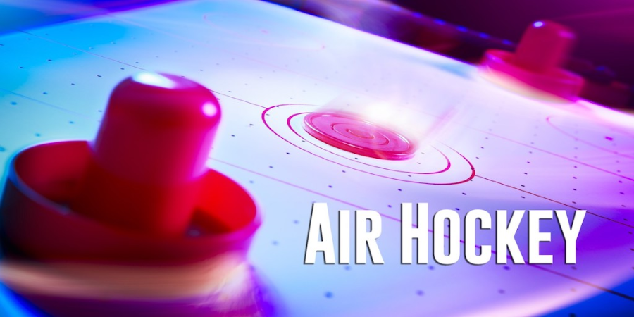
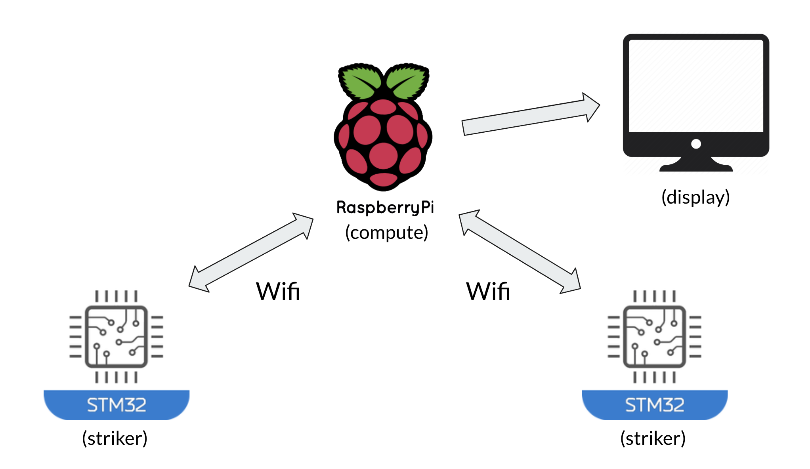
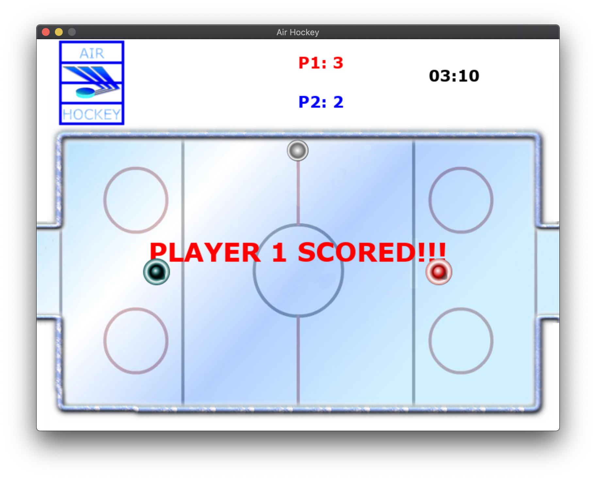

# 2019-AirHockey

* [Motivation](#motivation)
* [Implementation](#implementation)
    * [Architecture](#architecture)
    * [STM32](stm32)
        * [Sensor (Accelerometer)](#sensor-(accelerometer))
        * [BLE](#ble)
        * [Wifi](#wifi)
        * [Event Queue](#event-queue)
        * [Interruption](#interruption)
    * [RPi](#rpi)
        * [Game](#game)
        * [Threads](#threads)
* [Results](#results)
* [References](#references)

## Motivation
* Life is tiring and frustrating (especially for EE students). We need some entertainments!
* A project that releases our pressure
* Meets the requirements
    * Implement wifi socket programming
    * Use accelerometer in STM32
    * Assisted with RPi
* Interesting and competitive game!

## Implementation
### Architecture

### STM32
#### Sensor (Accelerometer)
Since acceleration is biased by approximately a constant value, calibration is done at the beginning to obtain the offset and is subtracted to get more precise values. For each timestep, STM32 sends the directions to RPi. We had tried sending acceleration, velocity, and displacement, and found that sending velocity is the best. We calculated the velocity by integrating the acceleration ([Riemann sum](https://en.wikipedia.org/wiki/Riemann_sum)), which is sampled every 1 - 2 ms. We also added a function such that if the player picks up the STM32 (changing the acceleration of Z-axis), STM32 will not update the values.  
Since the sensor is sometimes inaccurate, and the direction of acceleration and velocity may become opposite while braking, we let the velocity decay exponentially in this situation. Moreover, if it is detected as braking, we omit the next k sampled values to prevent it from "bouncing" back. This method significantly improved the performance. Nevertheless, despite the change we have made, it may still moves toward the opposite direction sometimes.

#### BLE
We first tried using BLE to connect the devices. STM32 sends 3 bytes to RPi, indicating right or left, up or down, and the ID of the player respectively. However, the performance does not reach our expectations: it sometimes disconnects, displays slowly, and is difficult to control. The problem lies in the huge delay of BLE: we discovered that for every 20 messages sent by notification, only 1 is received. This huge delay is intolerable, hence we abandoned this method (while the code is still in `./STM32LS75VG/ble/`.

#### Wifi
* **TCP Socket**  
To ameliorate the problem of delay, we tried communicating via TCP socket. Given that TCP guarantees reliable transmission, if a message is not received by the receiver, the sender is required to resend it. However, this is not suitable for real-time systems, e.g. games. In our experiment, the program often froze since it was waiting for data that should be received earlier to arrive, which made the game unplayable.

* **UDP Socket**  
Due to the above reasons and that all data sent by STM32 are not necessarily needed, UDP socket is a better choice. With UDP socket, the program did not suffer from stalling and achieved a higher data transmission rate compared to BLE. Although there still exists a minor delay, the result appears to be more stable and more controllable. Hence, this implementation performs best among all the others.

#### Event Queue
To sample from sensors and send data at the same time, we utilized an event queue to control works to be done by STM32. The LED also flashes to inform the user that STM32 is connected (also done by event queue). STM32 samples the acceleration every 2 ms, while sending data every 1ms.

#### Interruption
Although usually stable, the accelerometer and wifi sometimes malfunction while playing the game. Hence, to avoid reconnecting and recalibrating by restarting the program, we implemented a button interrupt to enable a player to perform in-game reconnecting and recalibrating, without affecting the other player.

### RPi
#### Game
The code is based on the [airhockey repository](https://github.com/ross85/airhockey) by [ross85](https://githuv.com/ross85) and modified to accept data from STM32, which is written with `pygame`.

#### Threads
Displaying the game and receiving data transmitted by STM32 in one single thread is not feasible since both tasks require a certain amount of time, thus delaying the other task. They must be handled simultaneously. This is made possible by applying 3 additional threads, which update the actions of the players, to increase the number of updates, while the main thread only displays the game. A timeout threshold of 0.3 ms is set to reduce the delay. Also, the received data are decoded by utf-8.

## Results

### 2 STM32s
* Process and send velocities of themselves to RPi
* Act as “strikers”
* Press button to recalibrate and reconnect

### RPi 
* Displays the game (locations of strikers, puck, and others)
* Calculates the movements of the “puck”

### Demo video
* Link: https://drive.google.com/file/d/1DMVhMzvl215tsdMatFl2ZeyUQp4JkgY9/view?usp=sharing

### Screenshots
* Starting menu 
* In game 
* Player scores 

## References
* ARM-MBED documents (sensors):  
https://os.mbed.com/teams/ST/code/DISCO_L475VG_IOT01-Sensors-BSP/file/986c1f5db128/main.cpp/
* airhockey  
https://github.com/ross85/airhockey
* UDP Socket  
https://os.mbed.com/docs/mbed-os/v5.9/reference/udpsocket.html
https://www.itread01.com/p/432886.html

